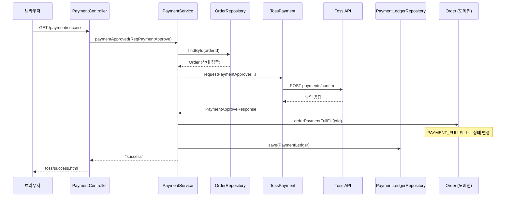

# 헥사고날 아키텍처와 도메인 처리 — 초보자용 가이드

## 1. 이 문서는 무엇을 설명하나?

이 프로젝트(`wanted_challenge_25`)는 **결제 서비스**를 만들기 위해 **헥사고날 아키텍처(Hexagonal Architecture)** 를 사용하고 있다.

헥사고날 아키텍처는 다른 이름으로 **포트와 어댑터(Ports & Adapters)** 아키텍처라고도 부른다.

초보자 입장에서 가장 먼저 이해할 점은 하나다.

> **"비즈니스 로직(핵심)은 가운데 두고, HTTP·DB·외부 API 같은 기술은 바깥으로 밀어낸다."**

이 문서에서는 다음을 순서대로 설명한다.

1. 헥사고날 아키텍처가 무엇인지 (쉬운 비유)
2. 이 프로젝트의 패키지 구조
3. **도메인**이 어떻게 처리되는지
4. 실제 API 한 건의 요청이 어떻게 흘러가는지
5. **흔히 오해하는 부분** 정리 (UseCase, 포트/어댑터, Service, JPA·record)

> PaymentController API만 더 깊게 보고 싶다면 [`payment-controller-flow.md`](./payment-controller-flow.md) 를 참고하면 된다.

---

## 2. 헥사고날 아키텍처 — 30초 요약

### 2-1. 왜 "헥사고날"인가?

육각형 모양은 **"여러 방향으로 연결될 수 있다"** 는 뜻이다.

- 위쪽: 브라우저가 보내는 HTTP 요청
- 아래쪽: MySQL 데이터베이스
- 옆쪽: Toss PG 결제 API
- 또 다른 옆: 나중에 추가할 다른 PG사

핵심 로직은 가운데에 있고, 바깥 세계와 연결하는 부품(어댑터)만 바꿔 끼우면 된다.

### 2-2. 포트(Port)와 어댑터(Adapter)

| 용어 | 쉬운 설명 | 이 프로젝트 예시 |
|------|-----------|------------------|
| **포트** | "이런 기능이 필요해"라고 정의한 **인터페이스(계약서)** | `CreateNewOrderUseCase`, `OrderRepository`, `PaymentAPIs` |
| **어댑터** | 포트 계약을 **실제 기술로 구현**한 클래스 | `OrderController`, `OrderRepositoryImpl`, `TossPayment` |
| **인바운드 어댑터** | 외부 → 안으로 요청을 **받아 들이는** 쪽 | `OrderController`, `PaymentController` |
| **아웃바운드 어댑터** | 안 → 밖으로 요청을 **보내는** 쪽 | `OrderRepositoryImpl`(DB), `TossPayment`(PG API) |

### 2-3. 의존 방향 (가장 중요한 규칙)

```text
[브라우저] → Controller → UseCase → Service → Port(인터페이스) → Adapter 구현체 → [DB / Toss]
                ↑              ↑              ↑
           presentation    application    infrastructure
```

**안쪽(도메인·애플리케이션)은 바깥(HTTP, JPA, Retrofit)을 몰라야 한다.**

그래서 컨트롤러는 `OrderService`가 아니라 `CreateNewOrderUseCase` **인터페이스**에 의존한다.

---

## 3. 이 프로젝트의 패키지 구조

프로젝트 최상위 패키지는 세 가지다.

```text
com.wanted.clone.oneport
├── core/       ← 공통 유틸 (응답 래핑, ID 생성 등)
├── member/     ← 회원 gRPC (헥사고날 미적용, 단순 3-tier)
└── payments/   ← 결제 (헥사고날 아키텍처의 핵심)
```

**결제(`payments`)** 만 레이어가 명확히 나뉜다.

```text
payments/
├── domain/entity/          ← 도메인 모델 (Order, PaymentLedger 등)
├── presentation/
│   ├── port/in/            ← 입력 포트 (UseCase 인터페이스)
│   └── web/                ← 입력 어댑터 (Controller, Request DTO)
├── application/
│   ├── port/out/           ← 출력 포트 (Repository, PG 인터페이스)
│   └── service/            ← 애플리케이션 서비스 (유스케이스 구현)
└── infrastructure/
    ├── persistence/mysql/  ← DB 출력 어댑터 (JPA)
    └── pg/toss/            ← Toss PG 출력 어댑터 (Retrofit)
```

### 레이어별 역할 한눈에 보기

| 레이어 | 역할 | "누가 일하나?" |
|--------|------|----------------|
| `presentation` | HTTP 요청 수신·응답 변환 | Controller |
| `presentation.port.in` | "주문 생성해줘" 같은 **유스케이스 계약** | `*UseCase` 인터페이스 |
| `application.service` | 여러 포트를 조합해 **흐름을 조율** | `OrderService`, `PaymentService` |
| `application.port.out` | "DB에 저장해줘", "PG에 승인 요청해줘" 계약 | `OrderRepository`, `PaymentAPIs` |
| `domain.entity` | **비즈니스 규칙과 상태** | `Order`, `PaymentLedger` |
| `infrastructure` | 포트를 **실제 기술로 구현** | `OrderRepositoryImpl`, `TossPayment` |

---

## 4. 도메인은 어떻게 처리되나?

### 4-1. "도메인"이란?

**도메인(Domain)** 은 소프트웨어가 다루는 **현실 세계의 개념**이다.

이 프로젝트에서는 예를 들어:

- 주문(Order)
- 주문 항목(OrderItem)
- 결제 원장(PaymentLedger)
- 주문 상태(ORDER_COMPLETED → PAYMENT_FULLFILL → …)

같은 것들이 도메인에 해당한다.

### 4-2. 도메인 코드 위치

도메인 클래스는 여기에 모여 있다.

```text
src/main/java/com/wanted/clone/oneport/payments/domain/entity/
├── order/
│   ├── Order.java           ← 주문 (애그리거트 루트)
│   ├── OrderItem.java       ← 주문 항목
│   ├── OrderStatus.java     ← 주문 상태 enum
│   └── PurchaseOrderId.java ← 복합 식별자 (값 객체)
└── payment/
    ├── PaymentLedger.java   ← 결제 원장
    ├── PaymentStatus.java
    └── card/
        └── CardPayment.java ← 카드 결제 상세
```

### 4-3. 이 프로젝트 도메인의 특징 (초보자가 알아둘 점)

#### ✅ 도메인 엔티티에 비즈니스 로직이 있다

`Order` 클래스는 단순 데이터 저장소가 아니다. **상태를 바꾸는 메서드**를 가지고 있다.

```java
// 결제가 완료되면 주문 상태를 PAYMENT_FULLFILL로 바꾸고 paymentId를 저장
public void orderPaymentFullFill(String paymentKey) {
    update(OrderStatus.PAYMENT_FULLFILL);
    this.paymentId = paymentKey;
}

// 주문 항목 금액을 합산해 totalPrice를 계산
public void calculateTotalAmount() {
    this.totalPrice = this.items.stream()
        .map(OrderItem::calculateAmount)
        .reduce(0, Integer::sum);
}
```

이런 식으로 **"결제 완료 시 주문 상태가 어떻게 바뀌는가"** 는 도메인(`Order`)이 알고 있다.

#### ✅ 값 객체(Value Object)도 있다

`PurchaseOrderId`는 `orderId` + `itemIdx` 두 값을 묶은 식별자다. `@Embeddable`로 JPA에 매핑된다.

`OrderStatus`, `PaymentStatus` 같은 enum도 도메인 개념을 표현한다.

#### ⚠️ JPA 엔티티 = 도메인 엔티티 (한 클래스가 두 역할)

이 프로젝트에서는 `@Entity`가 붙은 클래스가 **동시에**:

- 도메인 모델 (비즈니스 규칙)
- DB 테이블 매핑 (영속화)

역할을 한다. 이를 **Active Record에 가까운 방식**이라고 부른다.

이상적인 헥사고날에서는 도메인과 DB 매핑을 **별도 클래스**로 나누기도 하지만, 이 프로젝트는 **실용적으로 한 클래스에 합쳐** 두었다.

#### ⚠️ 별도 `domain/service` 패키지는 없다

도메인 서비스(Domain Service)란, 한 엔티티에 넣기 어려운 규칙을 담는 클래스다.

이 프로젝트에는 그런 클래스가 없고, 대신:

- **엔티티 메서드** → 상태 전이, 금액 계산
- **애플리케이션 서비스** → PG 호출, DB 저장, 트랜잭션 조율

로 나뉜다.

#### ⚠️ 완벽히 순수한 도메인은 아니다

초보자가 "이상적인 헥사고날"과 비교할 때 알아두면 좋은 점:

| 이상 | 이 프로젝트 현실 |
|------|------------------|
| 도메인은 JPA·HTTP를 모른다 | `@Entity`, `@Column`이 도메인 클래스에 붙어 있음 |
| DTO → 도메인 변환은 application 계층 | `ReqNewOrder.toEntity()`가 presentation 패키지에 있음 |
| 외부 API 타입은 infrastructure에만 | Toss 응답 DTO가 application·domain에 일부 침투 |

**결론:** 이 프로젝트의 도메인은 **"엔티티 중심 + 일부 Rich Domain"** 이다. 포트/어댑터 분리는 잘 되어 있지만, 도메인 순수성은 학습용·실무용 타협이 섞여 있다.

---

## 5. 도메인과 다른 레이어의 관계

도메인은 **가장 안쪽**에 있고, 바깥 레이어가 도메인을 **사용**한다.

```text
                    ┌─────────────────────────────┐
                    │   presentation (Controller)  │
                    │   HTTP 요청/응답 처리         │
                    └──────────────┬──────────────┘
                                   │ UseCase 호출
                    ┌──────────────▼──────────────┐
                    │   application (Service)      │
                    │   흐름 조율, 트랜잭션         │
                    └──────────────┬──────────────┘
                                   │ Port 호출
          ┌────────────────────────┼────────────────────────┐
          │                        │                        │
┌─────────▼─────────┐   ┌─────────▼─────────┐   ┌─────────▼─────────┐
│  domain (Entity)   │   │ infrastructure    │   │ infrastructure    │
│  Order             │   │ OrderRepositoryImpl│   │ TossPayment       │
│  PaymentLedger     │   │ (MySQL/JPA)       │   │ (Retrofit/Toss)   │
└───────────────────┘   └───────────────────┘   └───────────────────┘
```

**역할 분담을 한 문장으로:**

- **Controller**: "HTTP로 들어온 값을 UseCase에 넘긴다"
- **Service**: "주문을 검증하고, PG를 호출하고, 도메인 상태를 바꾸고, DB에 저장한다"
- **Domain**: "결제 완료면 내 상태를 PAYMENT_FULLFILL로 바꾼다"
- **Infrastructure**: "JPA로 save(), Retrofit으로 Toss API 호출"

---

## 6. API 예시 ① — `POST /order/new` (주문 생성)

가장 단순한 흐름이다. **도메인 객체가 어떻게 만들어지는지** 보기 좋다.

### 6-1. 요청 흐름

```text
클라이언트
  → POST /order/new + JSON body
  → OrderController.newOrder()
  → CreateNewOrderUseCase.createOrder()     ← 입력 포트
  → OrderService.createOrder()              ← 애플리케이션 서비스
  → ReqNewOrder.toEntity()                  ← DTO → Order 엔티티 변환
  → OrderRepository.save(Order)             ← 출력 포트
  → OrderRepositoryImpl → JpaOrderRepository ← DB 어댑터
  → RespNewPurchaseOrderMessage.from(Order) ← 응답 DTO
  → JSON 응답
```

### 6-2. 코드로 따라가기

**① Controller — HTTP 수신**

```java
@RestController
@RequestMapping("/order")
public class OrderController {
    private final CreateNewOrderUseCase createNewOrderUseCase;  // 인터페이스에 의존!

    @PostMapping("/new")
    public RespNewPurchaseOrderMessage newOrder(@RequestBody @Valid ReqNewOrder newOrder) {
        return RespNewPurchaseOrderMessage.from(createNewOrderUseCase.createOrder(newOrder));
    }
}
```

**② UseCase — 입력 포트 (계약서)**

```java
public interface CreateNewOrderUseCase {
    Order createOrder(ReqNewOrder newOrder) throws Exception;
}
```

**③ OrderService — 흐름 조율 (얇은 서비스)**

```java
@Service
public class OrderService implements CreateNewOrderUseCase {
    private final OrderRepository orderRepository;

    @Transactional
    @Override
    public Order createOrder(ReqNewOrder newOrder) throws Exception {
        return orderRepository.save(newOrder.toEntity());
    }
}
```

**④ ReqNewOrder.toEntity() — 도메인 객체 생성**

여기서 실질적인 도메인 조립이 일어난다.

```java
public Order toEntity() throws Exception {
    // 1. Order 루트 생성 (ID 자동 생성, 초기 상태 ORDER_COMPLETED)
    Order o = Order.builder()
        .orderId(IdGenerator.generateId(14))
        .name(this.getOrderer().getName())
        .phoneNumber(this.getOrderer().getPhoneNumber())
        .build();

    // 2. 주문 항목 추가
    o.getItems().addAll(this.convert2OrderItems(o));

    // 3. 항목이 없으면 예외
    if (Order.verifyHaveAtLeastOneItem(o.getItems())) throw new Exception("Noting Items");

    // 4. 도메인 메서드로 총액 계산
    o.calculateTotalAmount();

    return o;
}
```

**⑤ OrderRepository — 출력 포트**

```java
public interface OrderRepository {
    Order findById(String id);
    Order save(Order newOrder);
}
```

**⑥ OrderRepositoryImpl — DB 어댑터**

```java
@Repository
public class OrderRepositoryImpl implements OrderRepository {
    private final JpaOrderRepository jpaOrderRepository;

    @Override
    public Order save(Order newOrder) {
        return jpaOrderRepository.save(newOrder);
    }
}
```

### 6-3. 이 예시에서 도메인이 하는 일

| 단계 | 누가? | 무엇을? |
|------|-------|---------|
| 주문 ID 생성 | `IdGenerator` (core 유틸) | 14자리 ID |
| 초기 상태 설정 | `Order` 생성자 | `ORDER_COMPLETED` |
| 총액 계산 | `Order.calculateTotalAmount()` | 항목 금액 합산 |
| 항목 검증 | `Order.verifyHaveAtLeastOneItem()` | 최소 1개 항목 확인 |
| 저장 | `OrderRepository` → JPA | MySQL `purchase_order` 테이블 |

---

## 7. API 예시 ② — `GET /payment/success` (결제 승인)

Toss 결제 위젯에서 결제가 끝나면 브라우저가 이 URL로 리다이렉트된다.

**입력 어댑터 → PG API → 도메인 상태 변경 → DB 저장** 이 한 번에 이어지는 대표 흐름이다.

### 7-1. 요청 흐름

```text
브라우저 (Toss 리다이렉트)
  → GET /payment/success?orderId=...&paymentKey=...&amount=...&pgCorpName=toss
  → PaymentController.paymentFullfill()
  → PaymentFullfillUseCase.paymentApproved()   ← 입력 포트
  → PaymentService.paymentApproved()           ← 애플리케이션 서비스
      ├─ OrderRepository.findById()            ← 주문 상태 검증 (ORDER_COMPLETED인지)
      ├─ PaymentAPIs.requestPaymentApprove()   ← Toss 승인 API 호출
      ├─ Order.orderPaymentFullFill()          ← ★ 도메인 상태 변경
      └─ PaymentLedgerRepository.save()        ← 결제 원장 저장
  → PgWidgetUseCase.renderPgUi()               ← 성공/실패 화면 경로 반환
  → Thymeleaf 템플릿 렌더링 (toss/success.html)
```

### 7-2. 시퀀스 다이어그램



### 7-3. 코드로 따라가기

**① Controller**

```java
@Controller
@RequestMapping("/payment")
public class PaymentController {
    private final PgWidgetUseCase pgWidgetUseCase;
    private final PaymentFullfillUseCase paymentFullfillUseCase;

    @GetMapping("success")
    public String paymentFullfill(
        @RequestParam String orderId,
        @RequestParam String paymentKey,
        @RequestParam String amount,
        @RequestParam String pgCorpName
    ) throws Exception {
        String result = paymentFullfillUseCase.paymentApproved(
            ReqPaymentApprove.builder()
                .orderId(orderId)
                .paymentKey(paymentKey)
                .selectedPgCorp(PgCorp.valueOf(pgCorpName.toUpperCase()))
                .totalAmount(Integer.parseInt(amount))
                .build()
        );
        return pgWidgetUseCase.renderPgUi(PaymentRequest.of(pgCorpName), result);
    }
}
```

**② PaymentService — 핵심 오케스트레이션**

```java
@Transactional
@Override
public String paymentApproved(ReqPaymentApprove requestMessage) throws IOException {
    String orderId = requestMessage.getOrderId();

    // 1. 주문 상태 검증
    verifyOrderIsCompleted(orderId);

    // 2. PG 어댑터 선택 (toss → TossPayment)
    paymentAPIs = selectPgAPI(requestMessage.getSelectedPgCorp());

    // 3. Toss에 결제 승인 요청
    PaymentApproveResponse response = paymentAPIs.requestPaymentApprove(requestMessage);

    // 4. 승인 성공 시
    if (paymentAPIs.isPaymentApproved(response.getStatus().name())) {
        Order completedOrder = orderRepository.findById(orderId);

        // ★ 도메인 엔티티가 스스로 상태를 바꾼다
        completedOrder.orderPaymentFullFill(response.getTransactionId());

        // 결제 원장 저장
        paymentLedgerRepository.save(response.toEntity(requestMessage.getSelectedPgCorp()));

        return "success";
    }
    return "fail";
}
```

**③ 도메인 — 상태 전이**

```java
// Order.java
public void orderPaymentFullFill(String paymentKey) {
    update(OrderStatus.PAYMENT_FULLFILL);  // 주문 + 모든 항목 상태 변경
    this.paymentId = paymentKey;
}

private Order update(OrderStatus status) {
    this.status = status;
    this.getItems().forEach(item -> item.update(status));  // 항목도 함께 변경
    return this;
}
```

### 7-4. 이 예시에서 레이어별 역할 정리

| 레이어 | 이 API에서 하는 일 |
|--------|-------------------|
| `PaymentController` | 쿼리 파라미터 → `ReqPaymentApprove` 변환, 결과 화면 반환 |
| `PaymentFullfillUseCase` | "결제 승인 처리해줘" 계약 정의 |
| `PaymentService` | 검증 → PG 호출 → 도메인 변경 → DB 저장 순서 조율 |
| `Order` (도메인) | `PAYMENT_FULLFILL` 상태로 전이, `paymentId` 설정 |
| `TossPayment` (인프라) | Retrofit으로 Toss `payments/confirm` API 호출 |
| `OrderRepositoryImpl` (인프라) | JPA로 변경된 `Order` 저장 |

---

## 8. 입력 포트 vs 출력 포트 — 헷갈릴 때

| 구분 | 방향 | 위치 | 예시 | 누가 호출? |
|------|------|------|------|-----------|
| **입력 포트** | 밖 → 안 | `presentation.port.in` | `CreateNewOrderUseCase` | Controller가 호출 |
| **출력 포트** | 안 → 밖 | `application.port.out` | `OrderRepository`, `PaymentAPIs` | Service가 호출 |

기억법:

- **입력 포트** = "나한테 이런 일 해달라고 **요청**하는 창구"
- **출력 포트** = "나는 이런 일을 **외부에 맡기**는 창구"

---

## 9. 이 프로젝트가 잘 지키는 것 vs 아직 부족한 것

### 잘 지키는 것

1. **패키지 4분할**: `presentation` / `application` / `domain` / `infrastructure`
2. **Controller → UseCase 인터페이스** 의존 (구체 서비스에 직접 의존하지 않음)
3. **Service → Port 인터페이스** 의존 (DB·PG 구현체에 직접 의존하지 않음)
4. **다중 PG 확장 의도**: `Set<PaymentAPIs>`로 Toss 외 PG 추가 가능
5. **ArchUnit 테스트**로 레이어 규칙 일부 자동 검증

### 아직 이상적이지 않은 것 (학습 시 참고)

| 항목 | 현상 | 이상적인 방향 |
|------|------|---------------|
| 입력 포트 위치 | `presentation.port.in` | 보통 `application.port.in` |
| DTO 위치 | UseCase가 `ReqNewOrder` 등 웹 DTO 사용 | application 전용 Command/DTO 분리 |
| 도메인 순수성 | JPA 어노테이션이 도메인에 붙음 | 도메인·영속화 모델 분리 |
| `member` 모듈 | Service → Repository 직결 | payments처럼 포트/어댑터 적용 |

초보자는 **"완벽한 헥사고날"** 과 **"이 프로젝트의 실용적 헥사고날"** 을 구분해서 보면 이해가 빨라진다.

---

## 10. 흔히 오해하는 부분 정리

처음 헥사고날을 배울 때 자주 생기는 오해와, 이 프로젝트 기준으로 바로잡은 내용을 정리한다.

### 10-1. UseCase — "의존성이 전혀 없는 인터페이스"

#### 흔한 오해

> UseCase는 Controller와 Service 사이에 결합도를 낮춰 주고, **의존성을 갖지 않는** 인터페이스다.

#### 맞는 부분

- Controller는 `OrderService` 같은 **구현 클래스가 아니라** `CreateNewOrderUseCase` **인터페이스**에만 의존한다.
- UseCase는 **입력 포트(Inbound Port)** 로, "밖에서 안으로 들어오는 요청의 창구"다.
- `OrderService`가 UseCase를 **구현**한다.

```text
Controller → CreateNewOrderUseCase (계약) ← OrderService (구현)
```

#### 보완할 부분

- UseCase가 **의존성이 전혀 없는 것은 아니다.** 이 프로젝트에서는 `ReqNewOrder` 같은 웹 DTO에 의존한다.

```java
public interface CreateNewOrderUseCase {
    Order createOrder(ReqNewOrder newOrder) throws Exception;
}
```

- 이상적으로는 application 전용 Command/DTO를 쓰지만, 이 프로젝트는 presentation DTO를 그대로 받는 **실용적 타협**이다.

---

### 10-2. 포트와 어댑터 — "서버에서 외부로 나가는 연결 전부"

#### 흔한 오해

> 포트와 어댑터는 DB, HTTP 요청, PG API처럼 **서버에서 외부로 연결되는 모든 것**을 말한다.

#### 맞는 부분

- DB 저장, PG API 호출은 **아웃바운드(서버 → 외부)** 포트/어댑터가 맞다.
  - 포트: `OrderRepository`, `PaymentAPIs`
  - 어댑터: `OrderRepositoryImpl`, `TossPayment`

#### 보완할 부분 (중요)

**① 방향이 두 가지다**

| 방향 | 의미 | 예시 |
|------|------|------|
| **인바운드** (외부 → 서버) | 클라이언트 요청을 **받는** 쪽 | `PaymentController` (어댑터) ← `PaymentFullfillUseCase` (포트) |
| **아웃바운드** (서버 → 외부) | DB·PG에 **요청하는** 쪽 | `OrderRepository` (포트) → `OrderRepositoryImpl` (어댑터) |

HTTP 요청 **받기**도 포트/어댑터다. "서버에서 밖으로만"이 아니다.

**② 포트 ≠ 어댑터**

```text
포트(Port)     = 인터페이스 (계약서)   → "이런 기능이 필요해"
어댑터(Adapter) = 구현체 (실제 기술)   → "HTTP로 받을게", "JPA로 저장할게"
```

둘을 같은 말로 쓰면 헷갈린다. 항상 **포트(계약) + 어댑터(구현)** 쌍으로 기억하면 된다.

---

### 10-3. Service — "도메인을 호출만 하고 내부 로직은 모른다"

#### 흔한 오해

> Service는 도메인을 **호출만** 할 뿐, 도메인 **내부 로직에 대해서는 알지 못한다**.

#### 맞는 부분

- `orderPaymentFullFill()` **안에서** 상태가 어떻게 바뀌는지(주문 + 항목 동시 변경 등)는 Service가 몰라도 된다. 그건 도메인(`Order`)의 책임이다.
- Service가 도메인 **내부 구현**을 직접 작성하지 않는다.

#### 보완할 부분 (중요)

Service는 "호출만" 하는 게 아니라 **흐름을 조율**한다.

`PaymentService.paymentApproved()`를 보면:

```java
verifyOrderIsCompleted(orderId);              // ① Service 자체 로직 (검증)
paymentAPIs = selectPgAPI(...);               // ② Service 자체 로직 (PG 선택)
PaymentApproveResponse response = paymentAPIs.requestPaymentApprove(...);  // ③ 외부 호출
if (paymentAPIs.isPaymentApproved(...)) {
    completedOrder.orderPaymentFullFill(...); // ④ 도메인에 위임
    paymentLedgerRepository.save(...);        // ⑤ 저장
}
```

| Service가 하는 일 | 예시 |
|-------------------|------|
| **오케스트레이션** | 검증 → PG 호출 → 도메인 변경 → DB 저장 **순서** 결정 |
| **애플리케이션 로직** | `verifyOrderIsCompleted()`, `selectPgAPI()` |
| **도메인 위임** | `orderPaymentFullFill()` — "결제 완료 시 상태가 어떻게 바뀌는가" |

비유:

- **도메인**: "결제 승인되면 주문 상태를 `PAYMENT_FULLFILL`로 바꾼다" (규칙)
- **Service**: "PG 승인이 성공했을 때만 그 메서드를 호출한다" (흐름)

> Service = 도메인 호출만 ❌  
> Service = **흐름을 조율하고, 세부 규칙은 도메인에 맡긴다** ✅

---

### 10-4. 도메인과 JPA `@Entity` — "한 클래스에 두 역할이 섞인다"

#### 흔한 오해

> 도메인 패키지에 있으니까 **순수한 비즈니스 모델**이다.

#### 현실 (이 프로젝트)

`Order.java` 한 파일에 **두 종류의 코드**가 같이 있다.

```java
@Entity                          // ← DB 저장 방식 (JPA)
@Table(name = "purchase_order")
public class Order {
    @OneToMany(...)              // ← 영속화 설정
    private List<OrderItem> items;

    public void orderPaymentFullFill(...) { ... }  // ← 비즈니스 규칙
}
```

| 관심사 | `Order`에 섞인 것 |
|--------|-------------------|
| 비즈니스 | 결제 완료 시 상태 변경 |
| JPA | `@Entity`, `FetchType.LAZY`, `CascadeType` |
| DB 스키마 | `@Column(name = "order_state")` |

이걸 **"JPA `@Entity`와 도메인이 한 클래스"** 라고 표현한다. 도메인 모델이면서 동시에 DB 테이블 매핑 클래스다.

#### 분리하면 어떻게 되나?

이상적인 헥사고날에서는 역할을 나눈다.

```text
Order (domain)           → 비즈니스만, JPA import 없음
OrderJpaEntity (infra)   → @Entity, @Column 등 DB 매핑만
OrderMapper (infra)      → Order ↔ OrderJpaEntity 변환
OrderRepositoryImpl      → save/find 시 Mapper 사용
```

```text
PaymentService
  → orderRepository.findById()
      → OrderJpaEntity (DB에서 읽음)
      → OrderMapper.toDomain() → Order (순수 도메인)
  → order.orderPaymentFullFill()
  → orderRepository.save(order)
      → OrderMapper.toJpaEntity() → DB 저장
```

| | 현재 (합침) | 분리 |
|--|------------|------|
| 클래스 수 | `Order` 1개 | `Order` + `OrderJpaEntity` + `OrderMapper` |
| 도메인 순수성 | 낮음 | 높음 |
| 코드량 | 적음 | 많음 |

둘 다 틀린 방식은 아니다. **코드량 vs 순수성** 트레이드오프다.

---

### 10-5. 순수 도메인 = `record`?

#### 흔한 오해

> 순수 도메인은 보통 **record**로 나타낸다.

#### 맞는 부분

- **값 객체(Value Object)** 는 record로 표현하는 경우가 많다.
- record는 생성 후 필드 변경이 불가능한 **불변 객체**다 (`final` 필드, setter 없음).

```java
// 값 객체 → record가 자연스러움
public record PurchaseOrderId(String orderId, int itemIdx) {
    public PurchaseOrderId {
        if (itemIdx < 1) throw new IllegalArgumentException("itemIdx는 1 이상");
    }
}
```

#### 보완할 부분

**순수 도메인 전체를 record로 만드는 것은 아니다.**

| 종류 | 보통 형태 | 이유 |
|------|-----------|------|
| 값 객체 (`PurchaseOrderId`, 금액) | `record` | 불변, equals/hashCode 자동 |
| 엔티티/애그리거트 (`Order`) | `class` | 상태가 바뀜 (`ORDER_COMPLETED` → `PAYMENT_FULLFILL`) |
| Enum (`OrderStatus`) | `enum` | 고정된 상태 집합 |

`Order`처럼 `orderPaymentFullFill()`로 **상태를 바꾸는** 모델은 class가 일반적이다. record로 만들려면 변경마다 **새 인스턴스를 반환**하는 불변 스타일이 되어, 연관 객체가 많을 때는 번거롭다.

#### record 불변성 한 줄 정리

> record = 생성 시 값이 고정되고, 필드 재할당 불가.  
> 단, 내부에 `ArrayList` 같은 mutable 객체를 넣으면 **내용은 바뀔 수 있음** (얕은 불변).  
> 값 객체에는 `String`, primitive, `List.copyOf(...)` 등을 쓰는 것이 안전하다.

---

### 10-6. 오해 vs 정리 — 한눈에 표

| 주제 | 흔한 오해 | 바로잡기 |
|------|-----------|----------|
| UseCase | 의존성이 전혀 없는 인터페이스 | Controller↔Service 결합도는 낮춤. 다만 DTO 의존은 있음. **입력 포트** |
| 포트/어댑터 | 서버→외부 연결만 해당 | **인바운드(HTTP 수신)** + **아웃바운드(DB·PG)** 둘 다. 포트≠어댑터 |
| 도메인 | 비즈니스 로직을 가진다 | ✅ 맞음. 다만 JPA `@Entity`와 한 클래스인 **실용적 형태** |
| Service | 도메인 호출만, 내부 로직 모름 | **흐름 조율** + 애플리케이션 로직. 세부 규칙만 도메인에 위임 |
| 순수 도메인 | record로 표현한다 | **값 객체**는 record, **엔티티**는 class가 일반적 |
| JPA와 도메인 | domain 패키지 = 순수 | 이 프로젝트는 **합쳐 둠**. 분리하면 `Order` + `OrderJpaEntity` + Mapper |

---

## 11. 핵심 정리

```text
┌──────────────────────────────────────────────────────────────┐
│  이 프로젝트의 헥사고날 아키텍처 한 줄 요약                      │
│                                                              │
│  Controller는 UseCase만 알고,                                │
│  Service는 흐름을 조율하고 Port를 통해 외부에 맡기며,         │
│  도메인(Order)은 자기 상태 전이 규칙을 알고,                   │
│  Infrastructure가 HTTP·DB·Toss를 실제로 처리한다.             │
└──────────────────────────────────────────────────────────────┘
```

| 질문 | 답 |
|------|-----|
| 도메인은 어디 있나? | `payments/domain/entity/` |
| 도메인 로직은 어디 있나? | 주로 엔티티 메서드 (`orderPaymentFullFill`, `calculateTotalAmount` 등) |
| 흐름 조율은 누가 하나? | `application/service/` — 검증·PG 선택·호출 순서 등 **애플리케이션 로직** 포함 |
| DB·PG 접근은 누가 하나? | `infrastructure/` (`OrderRepositoryImpl`, `TossPayment`) |
| 요청은 어디서 시작하나? | `presentation/web/` (`OrderController`, `PaymentController`) |

---

## 12. 관련 파일 빠른 참조

| 개념 | 파일 경로 |
|------|-----------|
| 주문 도메인 | `payments/domain/entity/order/Order.java` |
| 결제 원장 도메인 | `payments/domain/entity/payment/PaymentLedger.java` |
| 주문 생성 UseCase | `payments/presentation/port/in/CreateNewOrderUseCase.java` |
| 결제 승인 UseCase | `payments/presentation/port/in/PaymentFullfillUseCase.java` |
| 주문 서비스 | `payments/application/service/OrderService.java` |
| 결제 서비스 | `payments/application/service/PaymentService.java` |
| 주문 Repository 포트 | `payments/application/port/out/repository/OrderRepository.java` |
| PG API 포트 | `payments/application/port/out/pg/PaymentAPIs.java` |
| DB 어댑터 | `payments/infrastructure/persistence/mysql/order/OrderRepositoryImpl.java` |
| Toss PG 어댑터 | `payments/infrastructure/pg/toss/TossPayment.java` |
| 아키텍처 테스트 | `src/test/java/com/wanted/clone/oneport/ArchTests.java` |

---

## 13. 더 읽어볼 문서

- [`payment-controller-flow.md`](./payment-controller-flow.md) — PaymentController 4개 API 상세 흐름
- [`HTTP-클라이언트-Retrofit-WebClient-RestTemplate-비교.md`](./HTTP-클라이언트-Retrofit-WebClient-RestTemplate-비교.md) — Toss 연동에 Retrofit을 쓰는 이유
- [`SPEC.md`](../../SPEC.md) — 프로젝트 전체 구현 구조 요약
